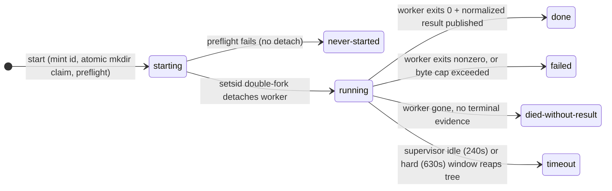

# Detached Peer Job Lifecycle for Cross-Model Review - Plan

## Goal Capsule

- **Objective:** the cross-model peer passes in `ce-doc-review` and `ce-code-review` survive the tool-call ceiling on every supported harness that passes the detach-survival qualification (verified 2026-07-14: Claude Code, codex CLI at `danger-full-access`, cursor-agent; default-sandboxed codex pending in U6), by running as detached, supervised jobs the orchestrator polls — and every peer artifact records requested-vs-verified model identity.
- **Authority:** this plan > repo conventions in the active instructions > implementer judgment on details the plan defers. The two grounding learnings are normative design inputs: `docs/solutions/skill-design/detached-job-lifecycle-for-delegated-work.md` and `docs/solutions/skill-design/requested-vs-verified-model-identity.md`.
- **Stop conditions:** stop and surface rather than guess if (a) the detached worker cannot be made to survive tool-call termination on a target host in the skill-creator eval, or (b) a route-test rewrite would require changing the peer scripts' adapter/egress semantics, which are out of scope.
- **Tail ownership:** standalone run owns the full shipping tail (review, PR); `mode:return-to-caller` callers own it per `ce-work` convention.

---

## Product Contract

### Summary

Add a bundled peer-job-runner (Python, byte-duplicated into both review skills) that detaches the existing cross-model peer scripts into their own session with durable job state, and change both skills' launch contract from "hold one Bash call open for up to 600s" to "start jobs in one short call, wait in bounded slices, fold in whatever finished by the aggregate deadline — and name any started peer that didn't finish." Additionally, parse the served-model receipt on routes that expose one and record `model_requested`/`model_actual` in every fold-in artifact.

### Problem Frame

Both skills instruct the orchestrator to launch the peer script and await its exit in a single shell tool call sized to the 600s hard cap (`skills/ce-doc-review/references/cross-model-review.md:78`, `skills/ce-code-review/references/cross-model-review.md:71`). Some harnesses enforce a lower ceiling on tool-call duration and kill the supervising shell mid-run; because the pass is deliberately non-blocking, the failure is a silent no-op — the review completes with a reviewer quietly missing. Internal timeouts cannot defend against external ones; the fix is structural (see the detached-job-lifecycle learning, including the measured result that plain `nohup` fails to detach on two of three tested hosts).

Separately, both skills announce and record which peer model reviewed the work using only the requested value. Measured 2026-07-14: the claude CLI reports the served model in its JSON envelope (`modelUsage`); the codex/grok/cursor CLIs do not, and a prompted self-report cannot substitute (the codex model answers that its serving identity is "not exposed" to it). The requested-vs-verified-model-identity learning defines the receipt pattern this plan wires in.

### Requirements

Detached lifecycle:

- R1. Launching, checking, and collecting never require a tool call that spans a peer's runtime: `start`, `status`, `result`, and `reap` return in under ~2 seconds, and the bounded `wait` subcommand blocks at most its `--max-secs` cap (default 30, always far below any harness ceiling), returning early when the watched jobs reach terminal states.
- R2. Job state survives the launching tool call: status, log, identity metadata, and result live in a durable job directory under `/tmp/compound-engineering/<skill>/<run-id>/jobs/<job-id>/`, created mode 0700 with files mode 0600, exclusive no-follow creation, and atomic rename for every publish.
- R3. The detached worker is supervised from inside the detached session with windows that sit outside the worker's own caps by an explicit margin (idle 240s vs the worker's 180s; hard 630s vs the worker's 600s), so the worker self-terminates first and the supervisor is the backstop; when both fire, the supervisor's terminal record wins classification.
- R4. The runner emits distinct first-class states — at minimum `running`, `done`, `failed`, `timeout`, `died-without-result`, `never-started` — classified by the runner from process and file evidence, never inferred by the orchestrator from prose. Exactly one terminal record, written atomically after classification.
- R5. The orchestrator waits in bounded `wait` slices interleaved with its other work and enforces an aggregate deadline of 610s measured from the final `start` (reserving margin for terminal classification). At the deadline it `reap`s every nonterminal job, runs one final collection pass, then folds in the `done` artifacts. Additive/non-blocking semantics are unchanged for passes that never started.
- R6. Detach-and-poll is the uniform contract on every supported host, including hosts where the old single-call await worked.
- R13. No silent terminal states: when a started job ends in any terminal state other than `done`, or is reaped at the aggregate deadline, the review's reconcile/Coverage output names the peer (lens/provider) and its terminal state (e.g. "codex peer: timeout after 600s"). Silent absence remains legitimate only for passes that were never started (existing gating/skip semantics).

Model-identity receipts:

- R7. On routes whose CLI reports the served model (claude today), the normalize step records `model_requested` and `model_actual` alongside the existing `cross_model_route` field; on mismatch, the artifact carries the actual value and the report warns prominently, never labeling output with the requested model.
- R8. On routes without a receipt — and on the claude route when `modelUsage` is absent, malformed, or unusable — `model_actual` is the literal string `unverified` (with a parse warning in the malformed case), never a fallback to the requested value; user-facing announce/reconcile lines say "requested <model>; serving model unverified on this route" instead of asserting the concrete model.
- R9. The cross-model agreement promotion is unchanged (label-only posture): agreement still promotes one anchor step; the rendered agreement note carries the verification state.

Safety and conventions:

- R10. Job-state I/O is hardened on both sides of the trust boundary: every read of job state from the predictable `/tmp` path verifies file ownership via `fstat` on the opened descriptor before content reaches agent context, and every directory/file creation uses no-follow semantics with owner-and-type verification on path components (per `docs/solutions/best-practices/predictable-tmp-cache-ownership-check.md`). `result` performs the ownership-checked open itself and emits the artifact content; fold-in consumers receive the job id and runner invocation, never a raw `/tmp` path to read unchecked. A failed check reports the job as unreadable, never trusts content.
- R11. Nothing in the detached path prompts for input; the runner is headless/CI-safe.
- R12. The runner ships byte-identical in both skills with a parity test, and its invocation in skill prose uses the `SKILL_DIR` anchor pattern (trailing `;` included).
- R14. Job content does not outlive its use: the orchestrator deletes each job directory after its result is folded in (or after deadline reaping), and `start` sweeps run-id roots older than 24h. Logs and results are treated as sensitive review content — confidentiality comes from R2's modes plus this retention rule.
- R15. Peer I/O is bounded: the supervisor enforces byte caps on `out.log` and the published result (exceeding them terminates the job with a classified `failed` state and recorded reason), and `status`/`result` reads are bounded so an oversized artifact cannot overwhelm the fold-in context.

### Scope Boundaries

- **Out of scope:** the ce-pov second-opinion panel and the ce-work delegated-execution engine (separate plans); any progress-marker protocol for review peers (byte-idle plus schema presence suffices for CLIs whose prompts we do not author); cost accounting; changes to peer adapters, isolation flags, egress allowlists, or prompt composition.
- **Deferred to Follow-Up Work:** receipt parsing for codex/grok/cursor when those CLIs expose a served-model field; migrating other long-running bundled scripts to the runner.

---

## Planning Contract

### Key Technical Decisions

- **KTD1 — Runner in Python, not bash.** `os.setsid` double-fork is native (macOS ships no `setsid(1)` binary, and the route-test sandbox confirmed its absence), `os.fstat` ownership checks are direct, and the script has 5 subcommands with error paths — the exact profile `docs/solutions/best-practices/prefer-python-over-bash-for-pipeline-scripts.md` routes to Python. Python 3 stdlib only, mirroring `scripts/repo-profile-cache.py`.
- **KTD2 — The peer scripts stay the workers; their lifecycle machinery is untouched.** `cross-model-doc-review.sh` / `cross-model-adversarial-review.sh` keep their adapters, least-privilege flags, internal caps, normalization, and atomic publish; the runner wraps them. U5 touches only their normalize step (receipt fields), nothing in their execution path. Consequence: the existing synchronous route tests keep driving the worker scripts directly and stay valid; only receipt-related normalize assertions extend.
- **KTD3 — Detach = setsid double-fork with all three stdio streams detached.** Measured 2026-07-14: plain `nohup` is reaped on tool-call end by the codex and cursor harness shell tools; a new session survives on all three tested hosts. The runner's `start` performs the double-fork itself (no perl dependency).
- **KTD4 — Single atomic terminal record.** The runner classifies the outcome (process exit plus result-file evidence) and writes one authoritative terminal status atomically; there is no separate exit-code file that can disagree. Status vocabulary follows R4 (taxonomy rationale: `docs/solutions/skill-design/watch-loops-need-a-blocked-external-terminal-state.md`).
- **KTD5 — Script owns mechanics; prose owns presentation.** All lifecycle logic (pid liveness, classification, ownership checks, receipt comparison, byte caps) lives in the runner and the worker scripts; SKILL.md/reference prose instructs only when to start, how to wait, and how to present outcomes (`docs/solutions/skill-design/script-first-skill-architecture.md`).
- **KTD6 — Label-only identity posture (reaffirmed).** Receipts are recorded and surfaced; the agreement promotion is not gated on them. Rationale: direct-CLI routes (codex, claude, grok) pin the provider by CLI selection, and measured behavior shows invalid model ids fail loudly on all three CLIs — the residual is serving-side substitution behind valid aliases. On aggregator routes (cursor-agent serving grok and composer aliases) a serving-side substitution could in principle cross model families; that residual is accepted knowingly because those routes are fallback/last-resort in the candidate order, the peer still runs in a separate process outside the host session, and gating would forfeit the promotion on three of four routes today for a rare, version-level risk. Revisit when more CLIs expose receipts (see Deferred).
- **KTD7 — Byte-duplication plus parity test.** No cross-skill imports; the runner is copied into each consumer with a greenfield byte-parity test mirroring `tests/repo-profile-cache-parity.test.ts`. Prove the parity test fails on injected one-sided drift before landing it (`docs/solutions/skill-design/paired-old-vs-new-injection-skill-evals.md`).
- **KTD8 — Argv hygiene, not an injection apparatus.** The runner execs argv lists directly (never a shell), mints job ids internally, restricts caller-supplied label fields to a safe character set, and callers place `--` before the worker argv. The real (narrow) vector is git-derived values an outside contributor can influence — e.g. a fork PR's branch name flowing into a composed command; on the user's own machine the orchestrating agent already holds shell access, so this is confused-deputy hygiene, not a privilege boundary.

### High-Level Technical Design

Job lifecycle owned by the runner (states per R4):



Orchestrator contract across tool calls (every call bounded; aggregate deadline caller-owned):

```mermaid
sequenceDiagram
    participant O as Orchestrator (skill prose)
    participant R as peer-job-runner.py
    participant W as Detached worker session<br/>(existing cross-model-*.sh)
    O->>R: start <skill> <run-id> -- bash cross-model-*.sh args (per lens/provider)
    R-->>O: job-id (sub-second)
    R->>W: setsid double-fork; worker runs with its own 180s/600s caps
    loop bounded slices until terminal or 610s from final start
        O->>R: wait --max-secs 30 <job-ids>
        R-->>O: states (returns early on terminal transitions)
    end
    O->>R: reap <job-id> (any job still nonterminal at deadline)
    O->>R: result <job-id>
    R-->>O: ownership-checked artifact JSON (or terminal state)
    Note over O: fold in done artifacts; name every started-but-not-done peer (R13)
```

### Assumptions

- Default-sandboxed codex has not been detach-verified (the measured codex result used `danger-full-access`); U6's eval covers it, and a failure there surfaces as a stop condition, not a silent ship.
- Detach survival on hosts beyond the measured trio (e.g. Gemini CLI; Grok per issue #1115) is unverified. The designed failure signal on such a host is benign and visible: status sticks at `running`, the aggregate deadline reaps the job, and R13 names the peer's terminal state in the output — the silent-vanish failure mode cannot recur even where detach fails.

---

## Implementation Units

### U1. Peer job runner in ce-doc-review

- **Goal:** the runner exists with the full lifecycle: `start` (mint id, atomic `mkdir` claim, preflight worker executability and status writability, setsid double-fork detach, print id; sweep run-id roots older than 24h), `status` (one state word per R4), `wait` (bounded block per R1, early return on terminal transitions), `result` (ownership-checked open of the worker's published artifact, emitting its content), `reap` (signal the detached supervisor and return fast; the supervisor performs TERM-grace-KILL deepest-first and writes the atomic terminal classification), plus the in-session supervisor (byte-growth idle 240s, hard cap 630s, byte caps per R15).
- **Requirements:** R1, R2, R3, R4, R10, R11, R14, R15.
- **Dependencies:** none.
- **Files:** create `skills/ce-doc-review/scripts/peer-job-runner.py`; create `tests/skills/peer-job-runner.test.ts`.
- **Approach:** subcommand CLI, stdlib only; job dir layout per R2 (`status`, `pid`, `out.log`, `meta.json`, worker result path); `meta.json` carries run id, lens/provider label, input digest (base SHA or doc digest), start time so a resumed orchestration never folds a stale prior attempt; all job-file I/O follows R10 (fd-based ownership checks on read, no-follow + owner/type-verified components on write, atomic rename); `subprocess` with argv lists only, internally-minted ids, safe-charset validation on label fields, `--` before worker argv (KTD8); JSON output on `status --json`/`wait --json` for deterministic tests; meaningful exit codes and stderr errors per `docs/solutions/agent-friendly-cli-principles.md`.
- **Patterns to follow:** `skills/ce-code-review/scripts/repo-profile-cache.py` (stdlib CLI shape, atomic writes); `tests/repo-profile-cache.test.ts` (spawnSync python3 against env-redirected tmp roots); `tests/skills/ce-doc-review-cross-model-routes.test.ts` `sandbox()` helper (PATH-isolated stub CLIs, `sleep` available) for lifecycle tests.
- **Test scenarios:**
  - Happy path: `start` a stub worker that writes output then exits 0 -> `status`/`wait` transition running -> done; `result` emits the artifact content. Covers R1 (assert wall-clock on every subcommand), R2, R4.
  - Detach survival: `start` a slow stub (writes every 2s for 30s); the launching `spawnSync` returns immediately; a later `status` shows `running` and the log grew after `start` returned.
  - Bounded wait: `wait --max-secs 5` against a stub finishing at ~2s returns early with the terminal state; against a stub finishing at ~30s returns at the cap with `running`.
  - Idle reap: stub that goes silent -> `timeout` state at the supervisor idle window; whole tree gone (no orphan pids).
  - Hard-cap and margin race: stub that ignores its own caps -> supervisor `timeout` at 630s; a stub whose worker-side cap fires first exits nonzero on its own -> classified `failed`/`done?`-equivalent by evidence, and when both fire the supervisor's record wins (R3 test).
  - Byte cap: stub that streams unbounded output -> terminated, `failed` with recorded oversize reason (R15).
  - Worker dies silently: stub killed externally without result -> `died-without-result`.
  - Preflight failure: nonexistent worker path -> `never-started`, no job detached, nonzero exit with actionable stderr.
  - Collision: two `start` calls forced onto one id -> second regenerates (atomic mkdir claim).
  - Ownership check (mandatory, not skippable): unit-level python test injecting a fake `fstat` uid mismatch -> `unreadable`, content never emitted — for both `status` and `result` paths.
  - Retention: `result` consumed then orchestrator delete; `start` sweeps a fabricated >24h-old run root (R14).
  - `reap`: running stub -> fast return; terminal classification recorded once by the supervisor; second `reap` is a safe no-op.
- **Verification:** `bun test tests/skills/peer-job-runner.test.ts` green; no orphan processes after the suite (assert via pid checks in teardown).

### U2. Byte-copy into ce-code-review plus parity guard

- **Goal:** ce-code-review carries an identical runner copy, guarded against drift.
- **Requirements:** R12.
- **Dependencies:** U1.
- **Files:** create `skills/ce-code-review/scripts/peer-job-runner.py`; create `tests/peer-job-runner-parity.test.ts`.
- **Approach:** mirror `tests/repo-profile-cache-parity.test.ts` (`RUNNER_ASSETS` x `CONSUMER_SKILLS`, byte equality). Before landing, inject a one-character drift into one copy and confirm the test fails, then revert.
- **Test scenarios:** parity test passes on identical copies; fails on injected one-sided drift (verified during development, not committed).
- **Verification:** `bun test tests/peer-job-runner-parity.test.ts` green.

### U3. ce-doc-review launch-contract rewiring

- **Goal:** ce-doc-review's cross-model pass starts peers through the runner and waits in bounded slices; no instruction anywhere requires a long-lived Bash call; started-but-not-done peers are named in output.
- **Requirements:** R1, R5, R6, R12, R13.
- **Dependencies:** U1.
- **Files:** modify `skills/ce-doc-review/SKILL.md` (Cross-Model Judgment Pass section); modify `skills/ce-doc-review/references/cross-model-review.md` (Step 4 and the fold-in step).
- **Approach:** replace the current launch-and-await contract (SKILL.md "await every script exit before synthesis"; reference Step 4 "Set the Bash tool timeout / block_until_ms high enough to cover the hard cap (default 600s) and await completion") with: one short `start` call per activated lens (plus the whole-doc sweep) in the same dispatch wave as the persona reviewers, each invocation carrying the `SKILL_DIR` anchor inline; between waves, `wait --max-secs 30` on outstanding jobs; at synthesis, loop bounded `wait` until every job is terminal or 610s from the final `start`, then `reap` nonterminal jobs, run one final collection pass, fold in `done` artifacts, and name every started-but-not-done peer with its terminal state in Coverage (R13). Delete consumed job dirs (R14). Fold-in, announce, gating, and skip semantics otherwise unchanged. Fold-in subagents receive job ids + runner invocation, not raw paths (R10).
- **Execution note:** keep the prose delta minimal — this is a contract swap, not a rewrite; preserve every egress/announce rule verbatim except the launch mechanics.
- **Test scenarios:** Test expectation: none for prose mechanics (behavioral wiring is U6's eval); `tests/skill-conventions.test.ts` must stay green (the new script mention must use a recognized `SKILL_DIR` invocation shape).
- **Verification:** `bun test` green; grep confirms no remaining "block_until_ms"/"await completion" launch language in the skill.

### U4. ce-code-review launch-contract rewiring

- **Goal:** same contract swap for ce-code-review's adversarial pass.
- **Requirements:** R1, R5, R6, R12, R13.
- **Dependencies:** U1.
- **Files:** modify `skills/ce-code-review/SKILL.md` (Stage 4 cross-model pass); modify `skills/ce-code-review/references/cross-model-review.md` (Step 4 and Step 5 fold-in).
- **Approach:** as U3, adjusted for the single adversarial peer (one `start`, bounded `wait` slices interleaved with Stage 4/5 work, 610s aggregate deadline with `reap` + final pass before Stage 5 fold-in, R13 naming in Coverage).
- **Test scenarios:** as U3; additionally `tests/review-skill-contract.test.ts` must stay green (verify its pinned Stage 4 wording is unaffected or update the pin with the contract change).
- **Verification:** `bun test` green; same grep check.

### U5. Model-identity receipts in both worker scripts

- **Goal:** fold-in artifacts carry `model_requested`/`model_actual`; announce and reconcile wording follows the receipt.
- **Requirements:** R7, R8, R9.
- **Dependencies:** U3, U4 (same reference files carry the announce wording).
- **Files:** modify `skills/ce-doc-review/scripts/cross-model-doc-review.sh` and `skills/ce-code-review/scripts/cross-model-adversarial-review.sh` (claude-route capture of `modelUsage`; normalize jq gains the two fields); modify the four announce/reconcile touchpoints — `skills/ce-code-review/SKILL.md:397`, `skills/ce-code-review/references/cross-model-review.md:44-51`, `skills/ce-doc-review/SKILL.md:228`, `skills/ce-doc-review/references/cross-model-review.md:43-50`; extend `tests/skills/ce-doc-review-cross-model-routes.test.ts` and `tests/skills/ce-code-review-cross-model-routes.test.ts` normalization assertions.
- **Approach:** requested value is the route's `M_*` constant; on the claude route, parse `modelUsage` from the captured envelope (note: the envelope lands in the peer log — PEERLOG — not the schema-extracted RAW_OUT, so capture it before normalization discards it) and set `model_actual` via a per-provider expected-prefix map (alias-to-dated-id resolution counts as a match; no substring matching). Absent, malformed, or unusable `modelUsage` yields `model_actual: "unverified"` with a prominent parse warning — never a fallback to the requested value (R8). Mismatch: keep `model_actual` as truth, log a prominent stderr warning, and require the reconcile step to surface it. All other routes set the literal `unverified`. Announce lines gain the "requested X; serving model unverified on this route" form for receipt-less routes. Kernel-parity test (`tests/skills/ce-code-review-cross-model-routes.test.ts:392-417`) continues to guard the shared constants.
- **Test scenarios:**
  - Claude-route stub emits an envelope with `modelUsage` matching the requested alias -> artifact has `model_requested` and a dated `model_actual`.
  - Claude-route stub emits a mismatched `modelUsage` -> artifact carries the actual id; stderr contains the mismatch warning.
  - Claude-route stub emits no/malformed `modelUsage` -> `model_actual` is `unverified`, parse warning present, artifact still folds in (R8).
  - Codex-route normalization -> `model_actual` is `unverified`; existing `cross_model_route` assertion unchanged.
  - Fields are additive: existing schema/enum pins in `tests/pipeline-review-contract.test.ts` stay green.
- **Verification:** both route-test suites green with the new assertions.

### U6. Docs and behavioral evaluation

- **Goal:** user-facing docs reflect receipts, and the launch->wait behavior is proven on real hosts.
- **Requirements:** R5, R6, R7, R8, R13 (documentation and behavioral proof).
- **Dependencies:** U3, U4, U5.
- **Files:** modify `docs/skills/ce-code-review.md` (cross-model section, ~lines 62-66) and `docs/skills/ce-doc-review.md` (~lines 119-127) for receipt semantics and the bounded-wait lifecycle one-liner; modify `skills/ce-doc-review/references/cross-model-eval.md` (extend the eval spec with launch->wait cases).
- **Approach:** eval via skill-creator with a fake-CLI harness (stub peer CLIs first on PATH per `docs/solutions/skill-design/fake-cli-harness-for-skill-judgment-evals.md`), asserting: the orchestrator starts jobs in short calls, waits in bounded slices rather than one long await, reaps and names a stub peer that never finishes (R13 wording present in Coverage), and renders unverified-identity wording. Run on Claude Code AND Codex (cross-host default), including one run under default-sandboxed codex to close the detach-verification assumption.
- **Execution note:** the sandboxed-codex detach check is the one genuinely empirical gate — if it fails, stop and surface (Goal Capsule stop condition) rather than shipping a host-conditional contract.
- **Test scenarios:** Test expectation: none (mechanical coverage lives in U1-U5; this unit's proof is the documented eval evidence).
- **Verification:** eval evidence recorded in the PR body; docs pages updated; `bun run release:validate` green.

---

## Verification Contract

| Gate | Command / method | Proves |
|---|---|---|
| Unit + route + parity tests | `bun test` | Runner lifecycle incl. wait/reap/margins/byte caps/ownership/retention (U1), byte parity (U2), receipt normalization + fallback (U5), conventions/shell-safety unaffected (U3/U4) |
| Plugin/marketplace consistency | `bun run release:validate` and `bun run plugin:validate` | Skill inventory and manifests consistent after content changes |
| Behavioral wiring | skill-creator eval per `skills/ce-doc-review/references/cross-model-eval.md` (extended), on Claude Code and Codex | Orchestrator starts-then-waits in bounded slices; deadline reap + R13 naming; unverified-identity wording |
| Detach on sandboxed codex | one eval run under default codex sandbox | The measured danger-full-access result generalizes (Assumptions) |
| No orphans | test teardown pid assertions (U1) | Reaping kills whole trees |

## Definition of Done

- All R1-R15 are implemented and traced to landed units; `bun test`, `release:validate`, and `plugin:validate` green.
- The skill-creator eval evidence (both hosts, including sandboxed codex) is recorded in the PR body.
- No skill prose anywhere instructs holding a tool call open for a peer's runtime, and no started peer can end silent: every non-`done` terminal state is named in output (R13).
- Abandoned experimental code from the work is removed; the diff contains only the plan's surfaces.
- One PR, conventional title `fix(review): ...` scoped per repo convention.

---

## Sources & Research

- `docs/solutions/skill-design/detached-job-lifecycle-for-delegated-work.md` — the lifecycle pattern and the measured detach matrix this plan implements.
- `docs/solutions/skill-design/requested-vs-verified-model-identity.md` — the receipt pattern, including measured CLI behavior (loud rejection of invalid models; self-reports non-authoritative).
- `docs/solutions/best-practices/predictable-tmp-cache-ownership-check.md` — mandatory fstat-on-fd ownership check and write-side hardening for R10.
- `docs/solutions/best-practices/prefer-python-over-bash-for-pipeline-scripts.md` — KTD1.
- `docs/solutions/skill-design/watch-loops-need-a-blocked-external-terminal-state.md` — R4's state taxonomy and R13's no-silent-terminal rule.
- `docs/solutions/skill-design/script-first-skill-architecture.md`, `docs/solutions/skill-design/pass-paths-not-content-to-subagents.md`, `docs/solutions/skill-design/bundled-script-path-resolution-across-harnesses.md` — KTD5, fold-in id-passing, and the `SKILL_DIR` anchor rules.
- `docs/solutions/skill-design/fake-cli-harness-for-skill-judgment-evals.md`, `docs/solutions/skill-design/paired-old-vs-new-injection-skill-evals.md`, `docs/solutions/skill-design/strong-models-mask-defensive-skill-fixes.md` — U6 eval method, parity-drift proof, and cross-host eval rationale.
- Existing guards inventoried for this plan: `tests/skills/ce-code-review-cross-model-routes.test.ts` (kernel parity :392-417, normalization :295-338), `tests/skills/ce-doc-review-cross-model-routes.test.ts` (normalization :351-433), `tests/repo-profile-cache-parity.test.ts` (parity pattern), `tests/skill-conventions.test.ts` (script-mention existence + anchor shapes), `tests/release-metadata.test.ts` (unaffected), `tests/pipeline-review-contract.test.ts` (schema-open fold-in fields).
